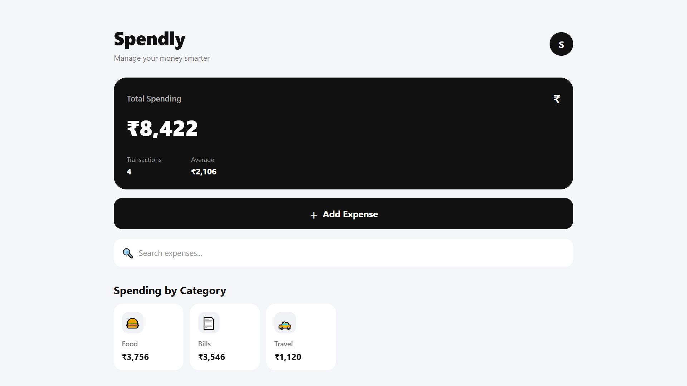
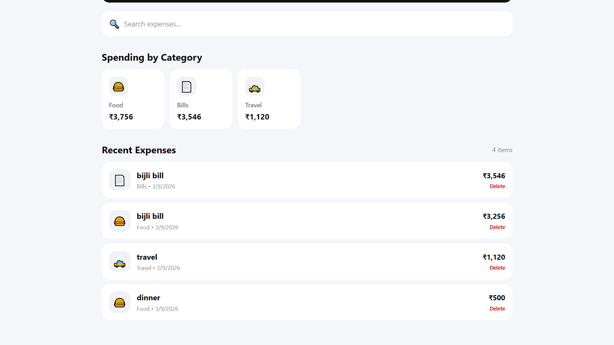

# 💰 Spendly

> **Manage your money smarter.**

Spendly is a simple and clean personal expense tracker built with **React Native and Expo**. It helps users track expenses, organize spending by category, search transactions, and view recent expenses.

## 🌐 Live Web App

👉 **[Open Spendly](https://spendlypro.vercel.app/)**

## 📱 Android App

The latest Android APK is available in GitHub Releases.

👉 **[Download Spendly APK](../../releases/latest)**

> The APK is currently provided for testing and personal use.

## ✨ Features

- 💰 Track total spending
- ➕ Add and manage expenses
- 🗂️ Organize expenses by category
- 🔍 Search expenses
- 📊 View spending by category
- 🧾 View recent expenses
- 🗑️ Delete expenses
- 💾 Local data storage
- 📱 Android support
- 🌐 Web support

## 📸 Screenshots

### 🏠 Home Screen



### ➕ Add Expense



## 🛠️ Tech Stack

- **React Native**
- **Expo**
- **Expo Router**
- **TypeScript**
- **AsyncStorage**
- **Vercel**
- **GitHub**

## 🚀 Getting Started

### 1. Clone the repository

```bash
git clone https://github.com/Nadeemxsalar/Spendly.git
```

### 2. Open the project

```bash
cd Spendly
```

### 3. Install dependencies

```bash
npm install
```

### 4. Start the development server

```bash
npx expo start
```

## 🌐 Run on Web

To run Spendly in a web browser:

```bash
npx expo start --web
```

## 📱 Build Android APK

To create an Android APK using EAS Build:

```bash
eas build --platform android --profile preview
```

## 📂 Project Structure

```text
Spendly/
├── assets/
│   ├── images/
│   └── screenshots/
│       ├── home.png
│       └── add-expense.png
├── src/
│   └── app/
│       ├── _layout.tsx
│       ├── index.tsx
│       └── add-expense.tsx
├── app.json
├── eas.json
├── package.json
├── README.md
└── LICENSE
```

## 💾 Data Storage

Spendly currently stores expense data locally using **AsyncStorage**.

The current version does not require an account or cloud database.

## 🌐 Deployment

The web version of Spendly is deployed using **Vercel**.

Every new push to the connected GitHub repository can trigger a new web deployment.

## 📦 Release

### v1.0.0

Initial release of Spendly with:

- Expense tracking
- Category-wise spending
- Search
- Recent expenses
- Local storage
- Android APK
- Web version

👉 **[View Releases](../../releases)**

## 📄 License

This project is licensed under the **MIT License**.

---

Made with ❤️ using **React Native & Expo**.